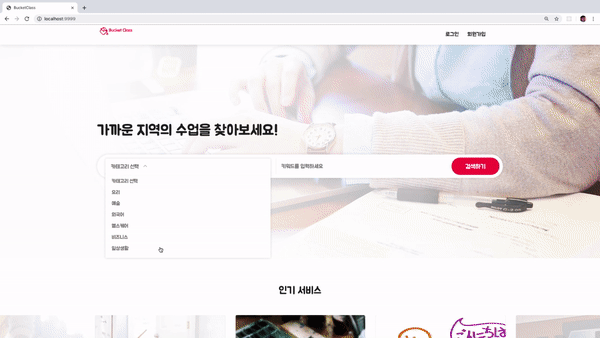
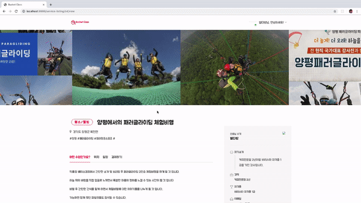

# :page_with_curl: Introduction
본 프로젝트는 자신만의 경험과 지식을 클래스로 개설해 여러 사람들과 공유할 수 있는 **오픈 클래스 플랫폼**이다.  
프리랜서 플랫폼 [Kmong](https://kmong.com/), [Soomgo](https://soomgo.com/), [Taling](https://taling.me/?gclid=CjwKCAjw5fzrBRASEiwAD2OSV8AU8w2OikxMB24Q2LpFZhDvbU7SrFV4jPQ66GYQ-NlB3N83SI613BoCqdAQAvD_BwE) 그리고 자유롭게 체험과 행사를 주최할 수 있는 [EventBrite](https://www.eventbrite.com/), [Meetup](https://www.meetup.com), [AirBnB Trip](https://www.airbnb.co.kr/s/experiences)를 레퍼런스하였다. 두 유형의 비즈니스 모델을 분석, 결합한 모델로 전문 기술만이 아닌 경험과 소소한 지식 또한 서비스의 대상이 될 수 있다는 점에서 차별화된 강점을 가지고 있다.  

# :mag_right: Preview

